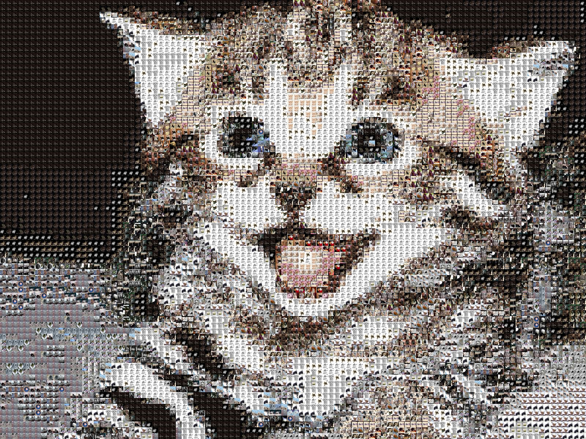

Catollage
-----------

Create a collage of an image using a set of images! For example, make a cat out of other cats!

Packages
~~~~~~~~

To utilize virtual environments on Ubuntu, I needed to install the following packages.

  $ sudo aptitude install build-essential gfortran libamd2.2.0 libblas3gf libc6 libgcc1 libgfortran3 libjpeg libjpeg-dev liblapack-dev liblapack3gf libopenblas-dev libstdc++6 libumfpack5.4.0 python-all-dev python-dev
